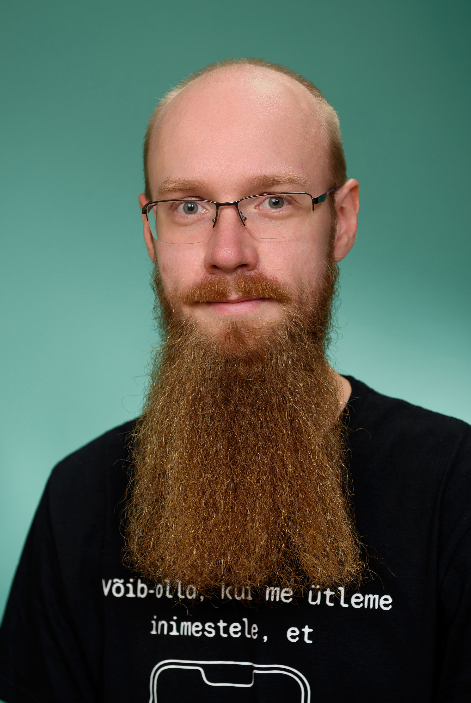

# Kaspar Kiltmaa

## Miks ma tulin õppima Haapsalu kolledžisse?

- Kui õppekava lugesin jäi mulle mulje segu dev-ist ja ops-ist. Kuna tulevikus plaanin sellesse rolli jõuda siis tundus Haapsalu selleks hea stardipunkt.
- Et saada juurde teadmisi ja oskusi ning ennast mugavustsoonist välja saada. Viimasest kooliteest on 10+ aastat möödas.
- Eriala, mida kaalusin TalTechis on ainult päevases õppes. See aga ei oleks sobitunud kuidagi praeguse elukorraldusega. Kolleegid, kellele seda mõtet jagasin soovitasid mõlemad Haapsalu kolledžit. Üks neist on praeguseks vilistalne, teine minust aasta ees.

<!--

**Here are some ideas to get you started:**

🙋‍♀️ A short introduction - what is your organization all about?
🌈 Contribution guidelines - how can the community get involved?
👩‍💻 Useful resources - where can the community find your docs? Is there anything else the community should know?
🍿 Fun facts - what does your team eat for breakfast?
🧙 Remember, you can do mighty things with the power of [Markdown](https://docs.github.com/github/writing-on-github/getting-started-with-writing-and-formatting-on-github/basic-writing-and-formatting-syntax)
-->
